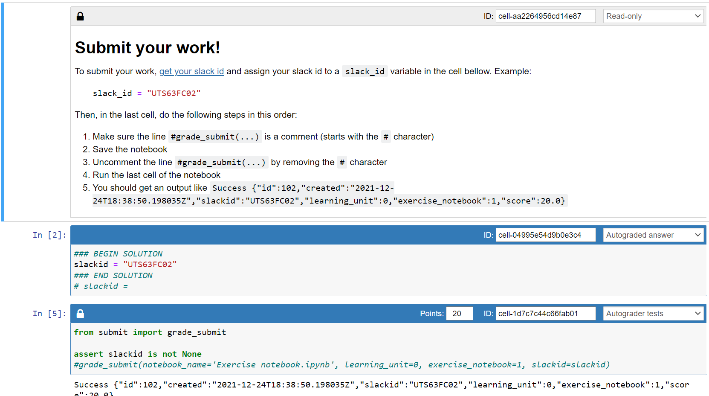

# Prep Course Portal


# For Instructors: grading

## Grading using Jupyter notebook
prep-course-portal/prep-course-portal/scripts/requirements.txt
1. Copy the `prep-course-portal/scripts/submit.py` file to the same folder as the Exercise Notebook.
2. Install the requirements on `prep-course-portal/scripts/requirements.txt`

```bash
pip install -r prep-course-portal/scripts/requirements.txt
```

3. Update the requirements of the LU you're working on

```bash
cd Week\ 00/SLU00\ -\ Jupyter\ Notebook/
pip freeze > requirements.txt
```

4. To enable students to submit a LU you'll need to add 3 cells at the bottom of the notebook, as follows (dont forget to set the learning unit number!):



**Cell 1** markdown, read-only

```markdown
# Submit your work!

To submit your work, [get your slack id](https://moshfeu.medium.com/how-to-find-my-member-id-in-slack-workspace-d4bba942e38c) and assign your slack id to a `slack_id` variable in the cell bellow.
Example:

```python
slack_id = "UTS63FC02"
```

Then, in the last cell, do the following steps in this order:
1. Make sure the line `#grade_submit(...)` is a comment (starts with the `#` character)
1. Save the notebook
1. Uncomment the line `#grade_submit(...)` by removing the `#` character
1. Run the last cell of the notebook
1. You should get an output like `Success {"id":102,"created":"2021-12-24T18:38:50.198035Z","slackid":"UTS63FC02","learning_unit":0,"exercise_notebook":1,"score":20.0}`
```

**Cell 2** code, Autograded Answer
```python
### BEGIN SOLUTION
slackid = "UTS63FC02"
### END SOLUTION
# slackid =
```

**Cell 3** code, Autograded tests, 0 points (dont forget to set the learning unit number!)
```python
from submit import grade_submit

assert slackid is not None
#grade_submit(notebook_name='Exercise notebook.ipynb', learning_unit=0, exercise_notebook=1, slackid=slackid)
```

This serves to collect the student slack ids so that we know who has submitted the LU.

# For maintainers

## Inserting example data

```bash
python scripts/send_initial_requests.py
```

## Running the server with python

before running the server

```bash
python manage.py makemigrations
python manage.py migrate
python manage.py collectstatic
```

running the server

```bash
python manage.py runserver
```

reset the database

```bash
# delete the sqlite file
rm db.sqlite3
python manage.py flush
python manage.py migrate --run-syncdb
```

## Running the server with docker-compose

Running the project

```bash
docker-compose up
```

Getting a shell in a running container

```bash
# get container id
docker ps
docker exec -it <mycontainer> bash
```

## Developing django: using the django jupyter notebook

### Installation

```bash
pip install django-extensions
```

add to `INSTALLED_APPS`

```python
INSTALLED_APPS = [
    ...
    'django_extensions',
]
```

Opens an django shell with

* settings already imported
* all your models already imported (and the import commands show up on screen)

```bash
python manage.py shell_plus --notebook
```

Then in the first cell of the notebook <https://stackoverflow.com/questions/61926359/django-synchronousonlyoperation-you-cannot-call-this-from-an-async-context-u>

```python
import os
import django
os.environ.setdefault('DJANGO_SETTINGS_MODULE', 'rest.settings')
os.environ["DJANGO_ALLOW_ASYNC_UNSAFE"] = "true"
django.setup()
```

### Example

Getting all the objects of a model in a pandas dataframe

```python
import json

from django.core import serializers

data = serializers.serialize("json", Submission.objects.all())
data = json.loads(data)
submissions = [sub['fields'] for sub in data]
df = pd.DataFrame(submissions)
df.to_csv('submissions.csv', index=False)
pd.read_csv('submissions.csv')
```

## Docs

* <http://127.0.0.1:8000/api/schema/swagger-ui/>
