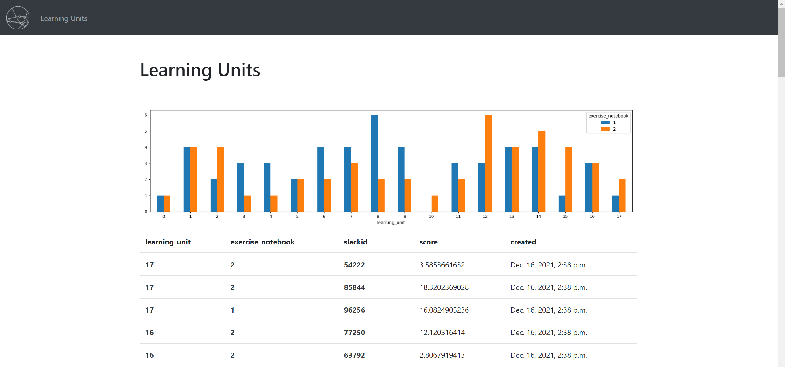

# Prep Course Portal



# For Instructors: grading

## Grading using Jupyter notebook

<https://github.com/LDSSA/ds-prep-course-instructors-2022/blob/main/README.md#323-grading-using-jupyter-notebook>

# For maintainers

## Inserting example data

```bash
python scripts/send_initial_requests.py
```

## Running the server with python

before running the server

```bash
python manage.py makemigrations
python manage.py migrate
python manage.py collectstatic
```

running the server

```bash
python manage.py runserver
```

reset the database

```bash
# delete the sqlite file
rm db.sqlite3
python manage.py flush
python manage.py migrate --run-syncdb
```

## Building and running with Docker

```bash
docker buildx build --platform linux/amd64 -t ldssa/prep-course-portal:68aa0ed .
docker push ldssa/prep-course-portal:68aa0ed
```

## Running the server with docker-compose

Running the project

```bash
docker-compose up
```

Getting a shell in a running container

```bash
# get container id
docker ps
docker exec -it <mycontainer> bash
```

## Developing django: using the django jupyter notebook

### Installation

```bash
pip install django-extensions
```

add to `INSTALLED_APPS`

```python
INSTALLED_APPS = [
    ...
    'django_extensions',
]
```

Opens an django shell with

* settings already imported
* all your models already imported (and the import commands show up on screen)

```bash
python manage.py shell_plus --notebook
```

Then in the first cell of the notebook <https://stackoverflow.com/questions/61926359/django-synchronousonlyoperation-you-cannot-call-this-from-an-async-context-u>

```python
import os
import django
os.environ.setdefault('DJANGO_SETTINGS_MODULE', 'rest.settings')
os.environ["DJANGO_ALLOW_ASYNC_UNSAFE"] = "true"
django.setup()
```

### Example

Getting all the objects of a model in a pandas dataframe

```python
import json

from django.core import serializers

data = serializers.serialize("json", Submission.objects.all())
data = json.loads(data)
submissions = [sub['fields'] for sub in data]
df = pd.DataFrame(submissions)
df.to_csv('submissions.csv', index=False)
pd.read_csv('submissions.csv')
```

## Docs

* <https://prep-course-portal.ldsacademy.org/api/schema/swagger-ui/>
    * sometimes it crashes when we open the docs, just wait a few seconds, then go to <https://prep-course-portal.ldsacademy.org/>, then go to <https://prep-course-portal.ldsacademy.org/api/schema/swagger-ui/> again
